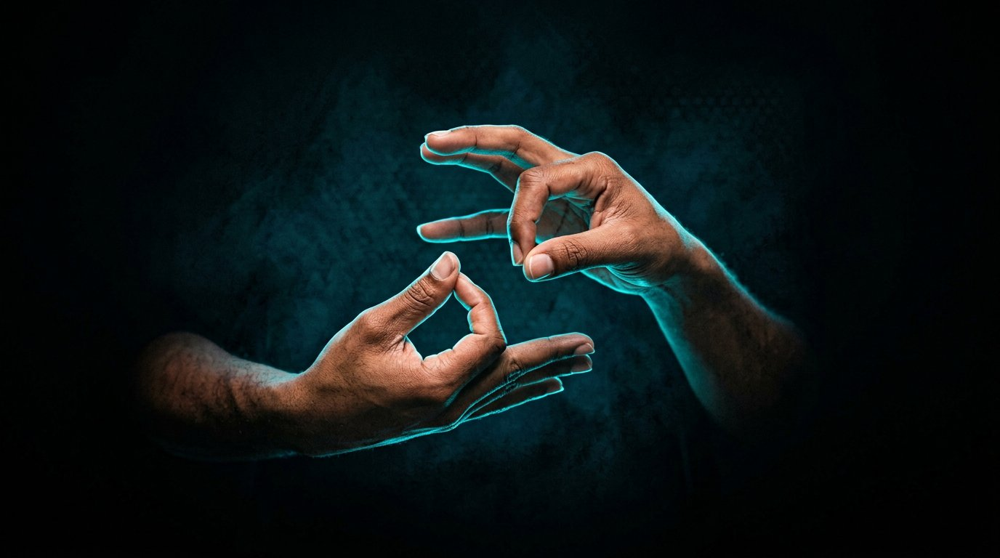

<div align="center">



# SignBridge

### Bridging Communication. Breaking Barriers.

An assistive communication platform that connects **Indian Sign Language (ISL)** and
**speech** through accessible, AI-powered browser technology.

`Sign → Text` &nbsp;·&nbsp; `Speech → Sign` &nbsp;·&nbsp; `Live Conversation`

<br />

[](https://sign-bridge-plum-eta.vercel.app/)
[](#current-status--roadmap)
[](#technology-stack)
[](#technology-stack)
[](#technology-stack)
[](#how-it-works)

<br />

[**Live demo**](https://sign-bridge-plum-eta.vercel.app/) ·
[**Launch the app**](https://sign-bridge-plum-eta.vercel.app/app/app.html) ·
[**Report an issue**](https://github.com/paul-idhant/SignBridge/issues) ·
[**Contact**](#contact)

</div>

<br />

<details open>
<summary><strong>Contents</strong></summary>

- [What is SignBridge?](#what-is-signbridge)
- [Advertisement](#-advertisement)
- [Modules at a glance](#modules-at-a-glance)
- [Recognised signs](#recognised-signs)
- [Language support](#language-support)
- [How it works](#how-it-works)
- [Technology stack](#technology-stack)
- [Getting started](#getting-started)
- [Project structure](#project-structure)
- [Browser support](#browser-support)
- [Privacy & accessibility](#privacy--accessibility)
- [Current status & roadmap](#current-status--roadmap)
- [Contributing](#contributing)
- [Team](#team)
- [Acknowledgements](#acknowledgements)
- [Contact](#contact)
- [License](#license)

</details>

---

## What is SignBridge?

Communication breaks down when two people do not share a communication method.
Conversations between sign-language users and speech users usually fall back to
typing, paper, or a third party — slow, impersonal, and never fully natural.

**SignBridge closes that gap in a single lightweight web page.** It reads hand
gestures from a webcam and turns them into text and speech in the listener's
language — and it takes spoken language and presents the matching Indian Sign
Language sign back. Each person simply uses the method that is natural to them;
SignBridge carries the meaning across.

```
   Sign language                                    Spoken language
  ┌───────────┐   Sign → Text    ┌───────────┐    Speech → Sign   ┌───────────┐
  │  🤟 hands  │ ──────────────► │ SignBridge │ ─────────────────► │  🗣 voice  │
  │           │ ◄────────────── │  two-way   │ ◄───────────────── │           │
  └───────────┘   spoken aloud  │     AI     │   animated sign    └───────────┘
                                └───────────┘
```

Everything runs **in the browser** — no install, no accounts, no server round-trip
for recognition. The camera feed is never shown; only a rendered skeleton of the
detected hand landmarks appears on screen.

---

## 🎬 Advertisement

The SignBridge advertisement film is being finalised. Once published it will be
embedded here and on the landing page. In the meantime, the fastest way to see the
product is the live demo:

> **▶ [sign-bridge-plum-eta.vercel.app](https://sign-bridge-plum-eta.vercel.app/)** —
> open the app, allow the camera, and try the two-way loop yourself.

---

## Modules at a glance

The product ([`public/app/app.html`](public/app/app.html)) is organised into six modules:

| Module | Status | What it does |
| --- | :--: | --- |
| **Sign → Text** | ✅ Live | Webcam hand tracking recognises a controlled ISL gesture set and outputs text + speech in your chosen language, fully on-device. |
| **ISL Library** | ✅ Live | 120+ authentic Indian Sign Language references — basics, family, questions, food, health, emergencies, emotions, school and places, plus the two-handed A–Z fingerspelling and 0–9. Every entry has a description, translations, synonyms and a dictionary reference video, playable in-app. |
| **Translator** | ✅ Live | Multilingual workbench across English and the 22 scheduled Indian languages, with microphone input, language swap and spoken output. |
| **Feedback** | ✅ Live | Star rating, message and referral links; submissions land in a Google Sheet, with an offline queue and retry. |
| **Speech → Sign** | 🚧 In development | Spoken language into realistic ISL sentence animation, larger vocabulary and multilingual speech recognition. |
| **Live Conversation** | 🔜 Planned | Real-time two-way translation of speech and ISL during a live conversation, with a shared transcript. |

The landing page you are looking at is a separate React site that documents and
launches the product.

---

## Recognised signs

The **Sign → Text** camera pipeline currently recognises a controlled vocabulary of
18 signs — finger-pattern, pinch, motion and two-hand gestures:

| Sign | How to show it | Sign | How to show it |
| --- | --- | --- | --- |
| `HELLO` | ✋ Open palm, all five fingers spread | `CALL` | 🤙 Thumb + pinky raised (phone) |
| `NO` | ✊ Closed fist | `ROCK` | 🤘 Index + pinky raised |
| `YES` | 👍 Thumbs up | `PROMISE` | 🖐️ Pinky finger only |
| `WHERE` | ☝️ Index finger pointing up | `L` | 🅻 Thumb + index out in an L shape |
| `HELP` | ✌️ Index + middle raised (V sign) | `I AM FINE` | 👌 Thumb + index pinched, 3 fingers up |
| `WATER` | 🖐️ Index + middle + ring raised | `OK` | 👌 Thumb + index circle, 3 fingers folded |
| `I LOVE YOU` | 🤟 Thumb + index + pinky raised | `NAMASTE` | 🙏 Both open palms together at the chest |
| `THREE` | 3️⃣ Thumb + index + middle raised | `THANK YOU` | 🖐️ Open palm, swept downward |
| `FOUR` | 4️⃣ Four fingers raised, thumb folded | `SORRY` | ✊ Fist circling over the chest |

Recognition is geometric, not pixel-matching: MediaPipe returns 21 landmarks per
hand, and each finger's extension is measured against the wrist anchor, then
matched to a five-bit pattern with confidence margins and a temporal stability
buffer. Motion signs (e.g. `THANK YOU`) add a short movement trail; `NAMASTE` uses
a two-hand classifier.

---

## Language support

SignBridge speaks and writes **23 languages** — English plus the 22 languages of the
Eighth Schedule of the Constitution of India. Each entry carries its own speech-recognition
locale, text-to-speech voice and text direction (Urdu, Kashmiri and Sindhi render
right-to-left).

> English · Hindi · Bengali · Telugu · Marathi · Tamil · Gujarati · Kannada · Malayalam ·
> Punjabi · Odia · Assamese · Urdu · Sanskrit · Maithili · Santali · Kashmiri · Nepali ·
> Sindhi · Konkani · Dogri · Bodo · Manipuri (Meitei)

Translation resolves in three tiers: a bundled offline phrasebook first, then Google's
public translation endpoint, then MyMemory — with a per-session cache so repeat phrases
never touch the network twice.

---

## How it works

```
 WebCAM ──► MediaPipe Hand Landmarker ──► 21 landmarks ──► gesture classifier
   │             (on-device, WebGL)             │                │
   │                                            ▼                ▼
   │                                     landmark skeleton   recognised word
   │                                        drawn to canvas        │
   │                                                               ▼
   │                              offline dictionary ──► gtx ──► MyMemory  (translation)
   │                                                               │
   └── never displayed on screen                                   ▼
                                                     text + Web Speech / TTS output
```

1. **Capture** — the webcam stream stays private; it is consumed only by the landmark model.
2. **Track** — MediaPipe's Hand Landmarker returns 21 points per hand, per frame, in real time.
3. **Classify** — finger-extension geometry is matched against the sign table; a temporal
   buffer smooths frame-to-frame jitter before a word is locked in.
4. **Translate** — the recognised word is translated into the target language through the
   three-tier pipeline above.
5. **Speak & show** — the result is spoken aloud with a script-aware voice and rendered in
   the correct writing system and direction.

The **ISL Library** works in the opposite direction: pick a sign and the app shows how it is
performed, its translations, and a dictionary reference video (Indian Sign Language Research
and Training Centre material) inside an in-app player.

---

## Technology stack

**Product (single-file app)**

| Layer | Technology | Role |
| --- | --- | --- |
| Vision | MediaPipe Hand Landmarker (Tasks JS) | 21 hand landmarks per frame, on-device |
| Speech in | Web Speech API (`SpeechRecognition`) | Spoken words → text, per-language locales |
| Speech out | `speechSynthesis` + network TTS fallback | Script-aware voices; Google TTS fallback |
| Translation | Offline phrasebook → Google gtx → MyMemory | Tiered, cached, offline-first |
| Rendering | Canvas 2D | Landmark skeleton, frame by frame |
| Runtime | One dependency-free HTML/CSS/JS file | ~7.7k lines, no build step, runs anywhere |

**Landing site (this repository's React app)**

| Layer | Technology |
| --- | --- |
| Framework | React 19 + TypeScript 5.9 |
| Build | Vite 7 (`vite-plugin-singlefile`) |
| Styling | Tailwind CSS 4 with a token-based theme system |
| Effects | `ogl` volumetric light rays, scroll-driven cinematics |
| Icons | `lucide-react` |
| Hosting | Vercel (static) |

---

## Getting started

**Prerequisites** — Node.js 20.19+ (or 22.12+), npm, and a modern browser
(Chrome or Edge recommended — see [browser support](#browser-support)).

```bash
# 1 · clone
git clone https://github.com/paul-idhant/SignBridge.git
cd SignBridge

# 2 · install
npm install

# 3 · develop (landing site)
npm run dev            # → http://localhost:5173

# 4 · production build (single self-contained index.html)
npm run build

# 5 · preview the build
npm run preview
```

**Run the product.** The app is a static file and needs a secure context for
camera and microphone access, so serve it rather than opening it from disk:

```bash
npm run dev            # then open http://localhost:5173/app/app.html
```

Grant camera (and microphone, for speech input) permission when prompted. On the
deployed site both live at
[`sign-bridge-plum-eta.vercel.app`](https://sign-bridge-plum-eta.vercel.app/) and
[`…/app/app.html`](https://sign-bridge-plum-eta.vercel.app/app/app.html).

> **Deploying:** push to GitHub and Vercel builds automatically; `vercel.json`
> rewrites every route to `index.html`. The build inlines all JS/CSS into one
> HTML file, and `public/` (app and images) is copied alongside it.

---

## Project structure

```
SignBridge/
├── public/
│   ├── app/app.html              # the product — single-file ISL ⇄ speech app
│   ├── team/                     # founder portraits
│   └── hero.jpg                  # landing hero photography
├── src/
│   ├── components/               # landing sections (Hero, About, …, Team)
│   ├── lib/                      # constants + hand-geometry data
│   ├── utils/                    # class-name helper
│   ├── App.tsx                   # page composition
│   └── index.css                 # theme tokens (change a colour once, site follows)
├── index.html                    # landing shell + SEO/OG meta
├── vercel.json                   # SPA rewrites
└── vite.config.ts                # React + Tailwind + single-file build
```

---

## Browser support

| Capability | Required for | Support |
| --- | --- | --- |
| WebGL 2 | MediaPipe hand tracking | All modern browsers |
| `getUserMedia` (camera) | Sign → Text | All modern browsers, secure context |
| Web Speech API — recognition | Speech input | Chrome / Edge (Chromium); other browsers fall back to typed input |
| `speechSynthesis` | Spoken output | All modern browsers (voice availability varies by OS) |
| HTTPS or `localhost` | Camera / mic permission | Required by all browsers |

---

## Privacy & accessibility

These are design commitments and current behaviour of an evolving prototype —
deliberately stated without absolute claims such as “100% private” or “100% accurate”.

- **No raw camera feed** — the stream is never displayed; only the landmark skeleton is drawn.
- **On-device vision** — hand landmarks are processed in the browser where possible.
- **No accounts, no tracking pixels** — feedback is opt-in and optional.
- **High-contrast interface** — white-on-black surfaces for maximum legibility, six themes.
- **Keyboard-first** — skip link, visible focus states, ARIA labelling throughout.
- **Reduced motion** — a setting (and `prefers-reduced-motion`) disables decorative animation.
- **Lightweight** — a small static build that loads fast and runs offline where it can.

---

## Current status & roadmap

SignBridge is an honest **prototype / MVP**: it demonstrates two-way sign ⇄ speech
communication with a controlled vocabulary and predefined gestures. It is not yet a
complete sign-language interpreter.

**It demonstrates today**

- Two-way sign ⇄ speech communication concept
- Real-time webcam hand-landmark rendering
- A working speech-to-sign translation pipeline
- An accessible, high-contrast, multilingual interface

**Current boundaries**

- Controlled vocabulary — a predefined gesture set, not open vocabulary
- Not a complete sign-language interpreter
- Accuracy varies with lighting, framing and camera quality

**On the roadmap**

- Realistic ISL hand animation for *Speech → Sign*, with continuous sentence signing
- *Live Conversation* — simultaneous two-way translation with a shared transcript
- Larger gesture vocabulary and motion-grammar recognition
- Offline language packs and a mobile-focused build

---

## Contributing

Contributions, corrections and Deaf-community feedback are warmly welcome —
especially from ISL users and interpreters. Sign accuracy matters more than feature count.

- **Report a problem or a wrong sign** — [open an issue](https://github.com/paul-idhant/SignBridge/issues).
- **Add a language** — extend `INDIAN_LANGUAGES` (code, native name, `srCode`, `ttsCode`,
  `dir`) and, for offline use, the phrasebook in `public/app/app.html`.
- **Add a camera gesture** — append `{ word, pattern }` to `CAMERA_GESTURES`; the pattern is
  five bits, thumb first, `1` = finger extended. The on-screen legend updates itself.
- **Add an ISL sign** — append to `ISL_REGISTRY` (id, word, label, description, synonyms,
  translations, category) and, when known, a reference video id in `ISL_VIDEO_MAP`.
- **Pull requests** — fork, branch from `main`, keep changes scoped, and describe what
  changed and why. The app file is intentionally a single, dependency-free document;
  please preserve that property.

---

## Team

Built with purpose by two students who wanted communication to be easier.

| | | |
| --- | --- | --- |
| **Idhant Paul** | Founder / Developer | [@paul_idhant](https://www.instagram.com/paul_idhant/) |
| **Felina** | Co-Founder / Designer | [@h.doungelll](https://www.instagram.com/h.doungelll/) |

SignBridge is an **IFNOVA** project.

---

## Acknowledgements

- **Google MediaPipe** — the Hand Landmarker model that makes on-device vision possible.
- **ISLRTC** (Indian Sign Language Research & Training Centre) — dictionary reference
  videos linked from the ISL Library.
- **Vercel** — static hosting for the live demo.

---

## Contact

Questions, partnerships, school projects or press — reach out on Instagram
([@paul_idhant](https://www.instagram.com/paul_idhant/),
[@h.doungelll](https://www.instagram.com/h.doungelll/)) or
[open an issue](https://github.com/paul-idhant/SignBridge/issues).

---

## License

SignBridge is not yet released under an open-source licence; all rights are reserved
by the authors. If you would like to use, adapt or build on any part of it — particularly
for accessibility work — please get in touch and we will gladly talk it through.

---

<div align="center">

**Every sign. Every voice. Two languages, one conversation.**

© IFNOVA · SignBridge · *Bridging Communication. Breaking Barriers.*

</div>
